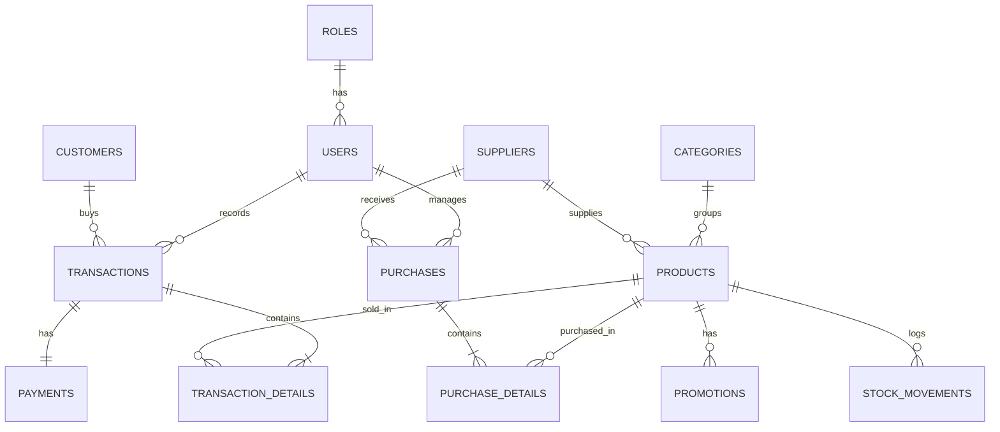
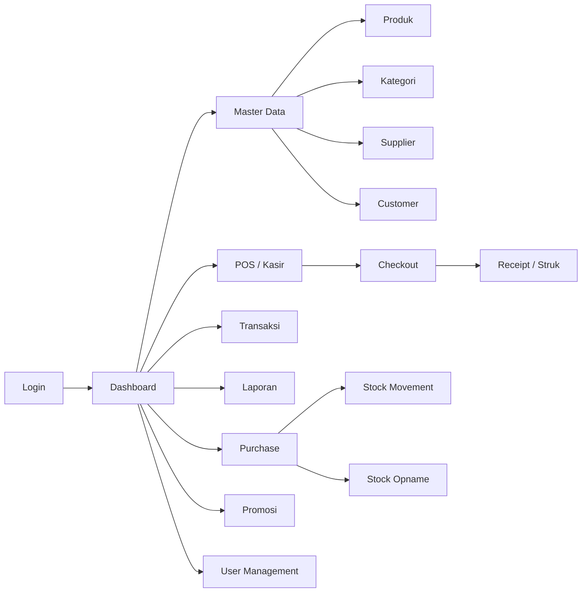

<p align="center">
    
</p>

<h1 align="center">SupermarketKu</h1>

<p align="center">
    <strong>Aplikasi Kasir & Manajemen Toko Modern Berbasis Web</strong>
</p>

<p align="center">
    
    
    
    
</p>

---

## 📌 Tentang SupermarketKu

SupermarketKu adalah aplikasi web Point of Sale (POS) dan manajemen toko retail berbasis Laravel. Aplikasi ini dirancang untuk membantu pemilik toko, admin, kasir, dan staf gudang dalam mengelola penjualan, stok barang, pembelian, pelanggan, serta laporan usaha secara terintegrasi.

---

## ✨ Fitur Utama

- Sistem kasir / POS untuk transaksi cepat dan terstruktur.
- Pencatatan transaksi penjualan lengkap dengan detail item, diskon, pajak, dan total akhir.
- Manajemen produk, kategori, supplier, pelanggan, dan promosi.
- Pembelian stok dari supplier dan pencatatan pergerakan stok.
- Laporan penjualan dalam format PDF dan Excel.
- Hak akses berbasis peran: Owner, Admin, Kasir, dan Gudang.
- Antarmuka modern berbasis Tailwind CSS.

---

## 👥 Hak Akses Pengguna

Aplikasi ini memiliki sistem role-based access control dengan pembagian akses sebagai berikut:

1. Owner / Pemilik Toko
   - Mengelola seluruh data master.
   - Memantau dashboard dan laporan penjualan.
   - Mengakses fitur penuh aplikasi.

2. Admin
   - Mengelola produk, kategori, supplier, dan akun pengguna tertentu.
   - Mengakses laporan serta fitur operasional inti.

3. Kasir
   - Mengakses halaman POS dan transaksi penjualan.
   - Melakukan checkout, mencetak nota, dan melihat riwayat transaksi.

4. Gudang / Logistik
   - Mengelola pembelian stok, stock opname, dan stock movement.
   - Memantau kondisi stok minimum.

---

## 🛠️ Teknologi yang Digunakan

- Laravel 12
- PHP 8.3 / 8.5
- MySQL
- Tailwind CSS
- Vite
- DomPDF untuk export PDF
- Maatwebsite Excel untuk export Excel

---

## 🧱 ERD (Entity Relationship Diagram)

Berikut gambaran relasi antar entitas utama dalam sistem SupermarketKu:



### Penjelasan Relasi Inti

- Satu role dapat memiliki banyak user.
- Satu user dapat mencatat banyak transaksi dan banyak pembelian stok.
- Satu customer dapat memiliki banyak transaksi.
- Satu transaksi memiliki banyak detail transaksi.
- Satu produk dapat muncul di banyak detail transaksi dan detail pembelian.
- Satu produk dapat memiliki banyak promosi dan banyak catatan pergerakan stok.
- Satu kategori memiliki banyak produk.
- Satu supplier dapat memasok banyak produk dan menerima banyak pembelian.
- Satu pembelian memiliki banyak detail pembelian.
- Satu transaksi memiliki satu pembayaran.

---

## 🔗 Relasi Web / Alur Aplikasi

Diagram berikut menunjukkan hubungan antar modul utama pada aplikasi web:



### Alur Bisnis Utama

- Pengguna masuk melalui halaman login lalu diarahkan ke dashboard sesuai role.
- Kasir mengakses POS untuk membuat transaksi, melakukan checkout, dan mencetak struk.
- Admin/Owner mengelola data master seperti produk, kategori, supplier, customer, dan pengguna.
- Gudang mengelola pembelian stok dan stock opname untuk menjaga ketersediaan barang.
- Sistem menghasilkan laporan penjualan yang dapat diekspor ke PDF atau Excel.

---

## 📦 Struktur Modul Utama

- Users & Roles
- Categories
- Suppliers
- Products
- Customers
- Promotions
- Transactions & Transaction Details
- Purchases & Purchase Details
- Stock Movements
- Payments

---

## ▶️ Cara Menjalankan Aplikasi

### Prerequisite

- PHP 8.3+
- Composer
- MySQL
- Node.js + npm

### Langkah Instalasi

```bash
composer install
cp .env.example .env
php artisan key:generate
php artisan migrate
npm install
npm run build
php artisan serve
```

Setelah server berjalan, buka alamat berikut di browser:

```bash
http://127.0.0.1:8000
```

---

## 🧪 Testing

Untuk menjalankan pengujian aplikasi:

```bash
php artisan test
```

---

## 📄 Lisensi

Proyek ini menggunakan lisensi MIT.

---

## 🤝 Kontribusi

Jika Anda ingin berkontribusi, silakan fork repository ini, buat branch fitur, lalu kirim pull request.
